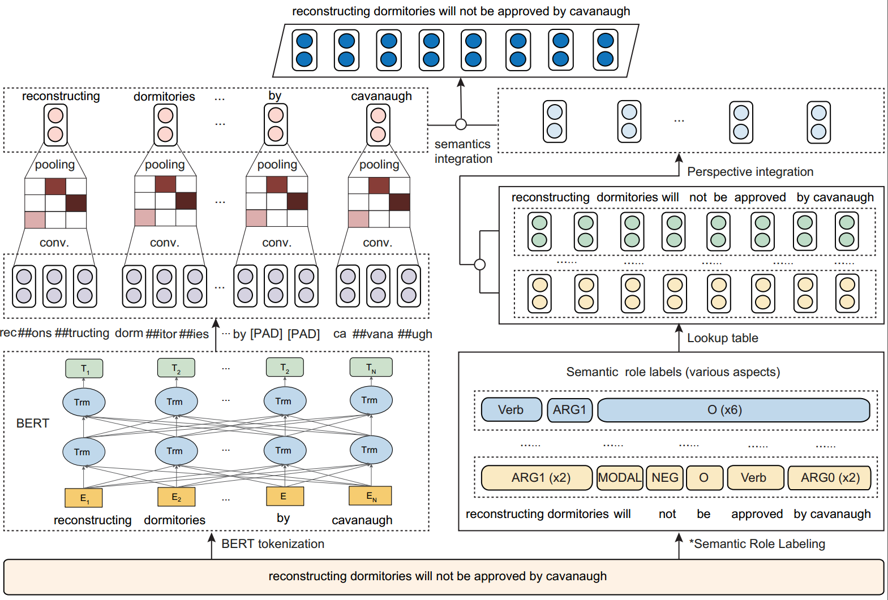

# SemBERT: Semantics-aware BERT for Language Understanding

**(2020/06/20) Update: Tips for possible issues**

"SRL prediction mismatches the provided samples"

The POS tags are slightly different using different spaCy versions.  SemBERT used spacy==2.0.18 to obtain the verbs.

Refer to [allenai/allennlp#3418](https://github.com/allenai/allennlp/issues/3418),  [cooelf/SemBERT#12](https://github.com/cooelf/SemBERT/issues/12) (CHN).

=========================================

Codes for the paper **[Semantics-aware BERT for Language Understanding](https://www.researchgate.net/publication/339301633_Semantics-aware_BERT_for_Language_Understanding)** in AAAI 2020

### **Overview**



## Requirements

(Our experiment environment for reference)

Python 3.6+
PyTorch (1.0.0)
AllenNLP (0.8.1)

## Datasets
GLUE data can be downloaded from [GLUE data](https://gluebenchmark.com/tasks) by running [this script](https://gist.github.com/W4ngatang/60c2bdb54d156a41194446737ce03e2e) and unpack it to directory <u>glue_data</u>.
We provide an example data sample in <u>glue_data/MNLI</u> to show how SemBERT works.

## Instructions
This repo shows the example implementation of SemBERT for NLU tasks.
We basically used the pre-trained BERT uncased models so do not forget to pass the parameter `--do_lower_case`.

The example script are as follows:

**Train a model**

Note: please replace the sample data with labeled data (use our labeled data or annotate your data following the instructions below).

```shell
CUDA_VISIBLE_DEVICES=0 \
python run_classifier.py \
--data_dir glue_data/SNLI/ \
--task_name snli \
--train_batch_size 32 \
--max_seq_length 128 \
--bert_model bert-wwm-uncased \
--learning_rate 2e-5 \
--num_train_epochs 2 \
--do_train \
--do_eval \
--do_lower_case \
--max_num_aspect 3 \
--output_dir glue/snli_model_dir
```

**Evaluation**

Both `run_classifier.py ` and  `run_snli_predict.py` can be used for evaluation, where the later is simplified for easy employment.

The major difference is that `run_classifier.py` takes labeled data as input, while `run_snli_predict.py` integrates the real-time semantic role labeling, so it uses the original raw data.

**Evaluation using labeled data**

```shell
CUDA_VISIBLE_DEVICES=0 \
python run_classifier.py \
--data_dir glue_data/SNLI/ \
--task_name snli \
--eval_batch_size 128 \
--max_seq_length 128 \
--bert_model bert-wwm-uncased \
--do_eval \
--do_lower_case \
--max_num_aspect 3 \
--output_dir glue/snli_model_dir
```

**Evaluation using raw data (with real-time semantic role labeling)** 

Our trained SNLI model (reaching 91.9% test accuracy) can be accessed here.

https://drive.google.com/drive/folders/1Yn-WCw1RaMxbDDNZRnoJCIGxMSAOu20_?usp=sharing

To use our trained SNLI model, please put the [SNLI model](https://drive.google.com/open?id=1Yn-WCw1RaMxbDDNZRnoJCIGxMSAOu20_) and the [SRL model](https://s3-us-west-2.amazonaws.com/allennlp/models/srl-model-2018.05.25.tar.gz) to the **snli_model_dir** and **srl_model_dir**, respectively.

As shown in our example SNLI model, the folder of **snli_model_dir** should contain three files:

*vocab.txt* and *bert_config.json* from the BERT model folder that are used for training your model;

*pytorch_model.bin* that is the trained SNLI model.

```shell
CUDA_VISIBLE_DEVICES=0 \
python run_snli_predict.py \
--data_dir /share03/zhangzs/glue_data/SNLI \
--task_name snli \
--eval_batch_size 128 \
--max_seq_length 128 \
--max_num_aspect 3 \
--do_eval \
--do_lower_case \
--bert_model snli_model_dir \
--output_dir snli_model_dir \
--tagger_path srl_model_dir
```

For prediction, use the flag: `--do_predict` for either the script `run_classifier.py` or `run_snli_predict.py`. The output pred file can be directly used for GLUE online submission and evaluation.

### Data annotation (Semantic role labeling)

We provide two kinds of semantic labeling method, 

* **online**: each word sequence are passed to label module to obtain the tags which could be used for online prediction. This would be time-consuming for large corpus. See  *tag_model/tagging.py*

  If you want to use the online one, please specify the `--tagger_path` parameter in the run.py file.

* **offline**: the current one that pre-process the datasets and save them for later loading for training and evaluation. See *tag_model/tagger_offline.py*

  Our labeled data can be downloaded here for quick start.

  [https://drive.google.com/file/d/1B-_IRWRvR67eLdvT6bM0b2OiyvySkO-x/view?usp=sharing](https://drive.google.com/file/d/1B-_IRWRvR67eLdvT6bM0b2OiyvySkO-x/view?usp=sharing)

Note this repo is based on the offline version, so that the column id/index in the data-processor would be slightly different from the original, which is like this:

text_a = line[-3]
text_b = line[-2]
label = line[-1]

If you use the original data <u>instead of</u> our preprocessed one by tag_model/tagger_offline.py, please modify the index according to the dataset structure.

### SRL model

The SRL model in this implementation used the [ELMo-based SRL model](https://s3-us-west-2.amazonaws.com/allennlp/models/srl-model-2018.05.25.tar.gz)  from [AllenNLP](https://github.com/allenai/allennlp). 

Recently, there is a new [BERT-based model](https://s3-us-west-2.amazonaws.com/allennlp/models/bert-base-srl-2019.06.17.tar.gz), which is a nice alternative. 

### Reference

Please kindly cite this paper in your publications if it helps your research:

```
@inproceedings{zhang2020SemBERT,
	title={Semantics-aware {BERT} for language understanding},
	author={Zhang, Zhuosheng and Wu, Yuwei and Zhao, Hai and Li, Zuchao and Zhang, Shuailiang and Zhou, Xi and Zhou, Xiang},
  	booktitle={the Thirty-Fourth AAAI Conference on Artificial Intelligence (AAAI-2020)},
	year={2020}
}
```
